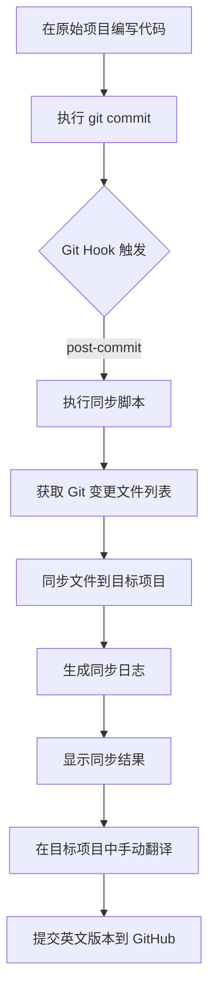

# 文件同步工具

一个用于将原始项目（中文注释）自动同步到目标项目（英文项目）的工具，支持通过 Git 检测变更文件并生成详细的同步日志。

## 功能特性

- ✅ **智能变更检测**：通过 Git 自动识别新增、修改、删除的文件
- ✅ **详细日志记录**：每次同步生成独立的日志文件，记录所有变更和文件路径
- ✅ **路径灵活性**：支持绝对路径和相对路径
- ✅ **配置文件支持**：通过 `config.json` JSON 配置文件管理路径，支持多个目标路径
- ✅ **跨平台支持**：提供 PowerShell（Windows）和 Bash（Linux/Mac/Git Bash）两个版本
- ✅ **自动化集成**：通过 Git Hook 实现自动同步
- ✅ **文件删除处理**：自动处理源项目中删除的文件

## 安装和配置

### 1. 准备项目目录

- **原始项目**：您编写代码的目录（包含中文注释）
- **目标项目**：用于同步到 GitHub 的目录（将翻译为英文），可以配置多个目标路径

### 2. 复制同步脚本

将 `syncScript` 文件夹复制到您的项目根目录。`syncScript` 文件夹包含：
- `sync_to_target.ps1` - PowerShell 同步脚本（Windows）
- `sync_to_target.sh` - Bash 同步脚本（Linux/Mac/Git Bash）
- `config.json` - 配置文件
- `.git_hooks/` - Git Hook 模板目录

### 3. 创建配置文件

在脚本所在目录创建 `config.json` 文件，配置路径信息：

```json
{
  "source_path": "F:\\person\\copyUpdateFiles\\source_path",
  "target_paths": {
    "default": "F:\\person\\target_path\\test\\target-test-path",
    "version2": "F:\\person\\target_path\\version2\\target-test-path"
  }
}

```

### 4. 设置脚本执行权限（Linux/Mac/Git Bash）

```bash
chmod +x sync_to_target.sh
```

**可选：安装 jq（推荐用于 JSON 解析）**

如果使用 JSON 配置文件，建议安装 `jq` 以获得更好的 JSON 解析支持：

```bash
# Ubuntu/Debian
sudo apt-get install jq

# macOS
brew install jq

# CentOS/RHEL
sudo yum install jq
```

**注意：** 即使没有安装 `jq`，脚本也能正常工作（使用内置的简单 JSON 解析器）。

### 5. Git Hook 自动安装

脚本会自动检测并安装 Git Hook。Git Hook 模板位于 `syncScript/.git_hooks/` 目录，脚本运行时会自动复制到 `.git/hooks/` 目录。

**注意**：
- Git Hook 会自动读取 `config.json` 配置文件
- Git Hook 使用增量同步模式（只同步变更的文件）
- 如果模板文件更新，脚本会自动更新已安装的 Hook

## 使用方法

### 方法一：增量同步（默认）

脚本会自动读取 `config.json` 配置文件，只同步 Git 变更的文件到所有配置的目标路径。

#### Windows PowerShell

```powershell
# 进入 syncScript 目录
cd syncScript

# 运行增量同步
.\sync_to_target.ps1
```

#### Linux/Mac/Git Bash

```bash
# 进入 syncScript 目录
cd syncScript

# 运行增量同步
./sync_to_target.sh
```

### 方法二：完全同步

使用 `--all` 参数进行完全同步，会同步所有文件（排除 `.gitignore` 中标记的文件、`syncScript` 文件夹等）。

#### Windows PowerShell

```powershell
cd syncScript
.\sync_to_target.ps1 --all
```

#### Linux/Mac/Git Bash

```bash
cd syncScript
./sync_to_target.sh --all
```

### 方法三：Git Hook 自动运行

配置好 Git Hook 后，每次执行 `git commit` 时，脚本会自动运行并同步文件。

```bash
# 在原始项目中提交代码
git add .
git commit -m "更新功能"

# 提交后，post-commit hook 会自动触发同步
# 同步完成后，切换到目标项目进行翻译和提交
cd ../my-project-en
git add .
git commit -m "Sync from Chinese project"
git push
```

## 工作流程




## 同步规则

### 包含的文件

- 所有源代码文件
- 配置文件
- 文档文件（README.md 等）
- 其他项目文件

### 排除的文件和目录

- `.git/` - Git 仓库目录
- `.syncScript_logs/` - 同步日志目录
- `syncScript/` - 同步脚本目录（不会同步到目标项目）
- `.gitignore` 中标记的文件和目录

## 测试项目使用示例

本项目包含一个测试项目 `test-project-cn/`，您可以使用它来测试同步功能：

### 1. 创建目标项目目录

```bash
# Windows PowerShell
New-Item -ItemType Directory -Path "test-project-en"

# Linux/Mac/Git Bash
mkdir test-project-en
```

### 2. 初始化目标项目的 Git 仓库（可选）

```bash
cd test-project-en
git init
cd ..
```

### 3. 创建配置文件

在 `syncScript` 目录中创建 `config.json` 文件：

```json
{
  "source_path": "F:\\person\\copyUpdateFiles\\source_path",
  "target_paths": {
    "default": "F:\\person\\target_path\\test\\target-test-path"
  }
}
```

**注意**：`source_path` 应该指向原始项目的根目录（包含 `syncScript` 的目录）。

### 4. 运行同步脚本

```bash
# Windows PowerShell
cd syncScript
.\sync_to_target.ps1          # 增量同步
.\sync_to_target.ps1 --all    # 完全同步

# Linux/Mac/Git Bash
cd syncScript
./sync_to_target.sh           # 增量同步
./sync_to_target.sh --all     # 完全同步
```

### 5. 查看同步结果

- 检查 `test-project-en/` 目录中的文件
- 查看 `.sync_logs/` 目录中的日志文件

### 6. 测试 Git Hook（可选）

```bash
# 在 test-project-cn 中修改文件
cd test-project-cn
echo "// 新代码" >> src/main.js
git add .
git commit -m "测试提交"

# Hook 会自动触发同步
```

## 常见问题

### Q1: 脚本提示"目标目录不存在"

**A:** 请先创建目标项目目录，或检查路径是否正确。

```bash
# 创建目录
mkdir my-project-en
```

### Q2: Git Hook 没有自动触发

**A:** 检查以下几点：
1. 确保 `.git/hooks/post-commit` 文件存在且有执行权限（Linux/Mac）
2. 检查 Hook 文件中的路径配置是否正确
3. 确保脚本路径正确

```bash
# Linux/Mac: 添加执行权限
chmod +x .git/hooks/post-commit
chmod +x sync_to_target.sh
```

### Q3: PowerShell 脚本无法执行

**A:** 可能需要设置执行策略：

```powershell
Set-ExecutionPolicy -ExecutionPolicy RemoteSigned -Scope CurrentUser
```

### Q4: 如何只同步特定文件？

**A:** 当前版本会同步所有变更的文件。如果需要过滤特定文件，可以修改脚本中的排除规则，或使用 Git 的 `.gitignore` 文件。

### Q5: 同步日志文件太多怎么办？

**A:** 可以定期清理旧的日志文件，或修改脚本添加日志保留策略。

```bash
# 删除 30 天前的日志文件（Linux/Mac）
find .sync_logs -name "sync_*.txt" -mtime +30 -delete
```

## 注意事项

1. **备份重要数据**：首次使用前，建议备份目标项目
2. **路径配置**：确保 Git Hook 中的路径配置正确
3. **翻译工作**：同步后仍需手动翻译文件内容
4. **Git 仓库**：目标项目可以是独立的 Git 仓库，用于推送到 GitHub

## 技术细节

### PowerShell 版本
- 使用 `robocopy` 进行文件同步（Windows 原生工具）
- 通过 `git diff` 获取变更文件列表
- 使用 PowerShell 的 `Out-File` 生成日志

### Bash 版本
- 使用 `rsync` 进行文件同步（跨平台工具）
- 通过 `git diff` 获取变更文件列表
- 使用标准输出重定向生成日志

## 许可证

本项目仅供学习和个人使用。

## 贡献

欢迎提交 Issue 和 Pull Request！

